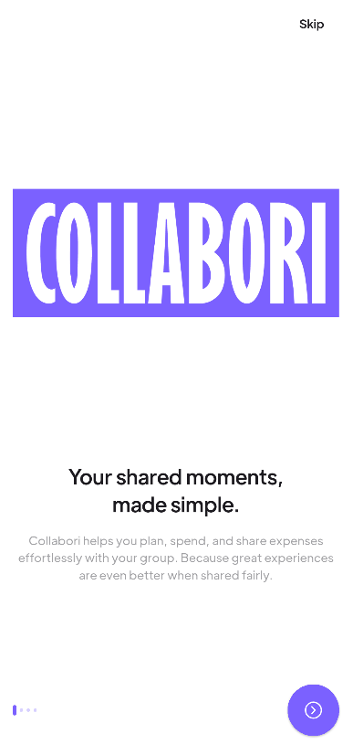
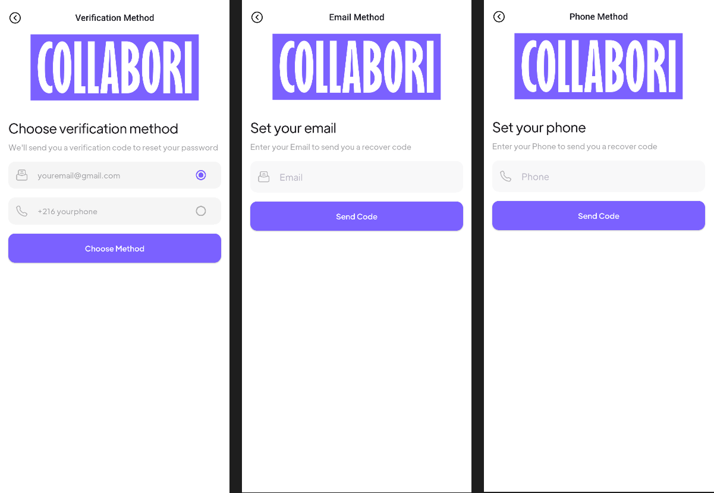
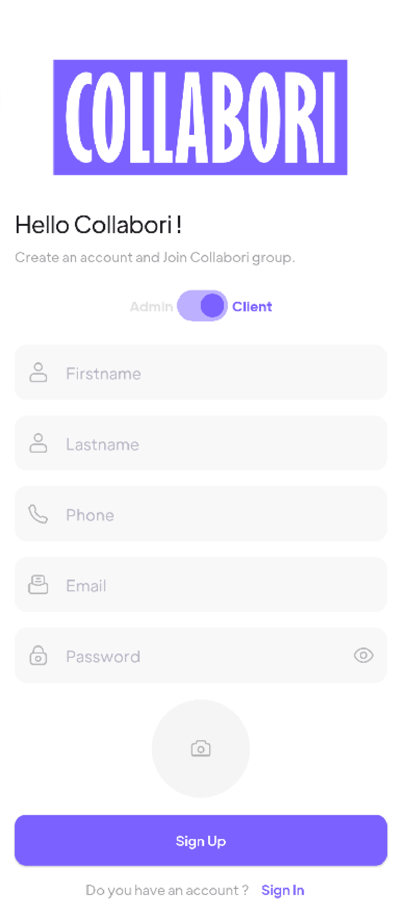
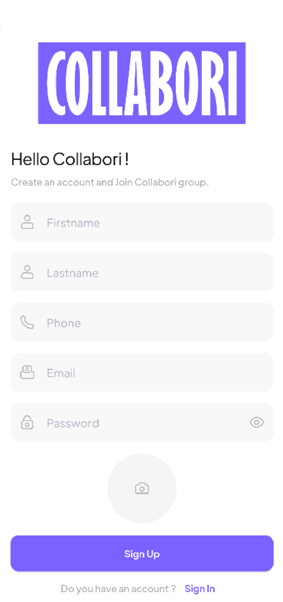
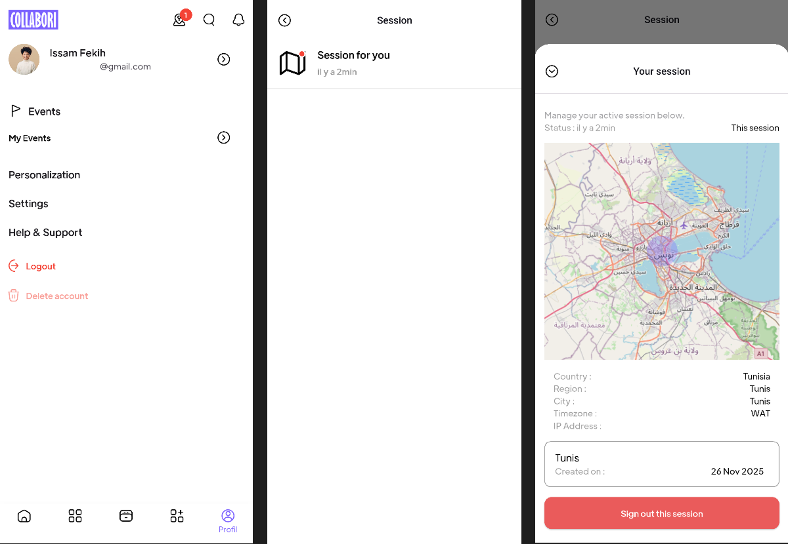
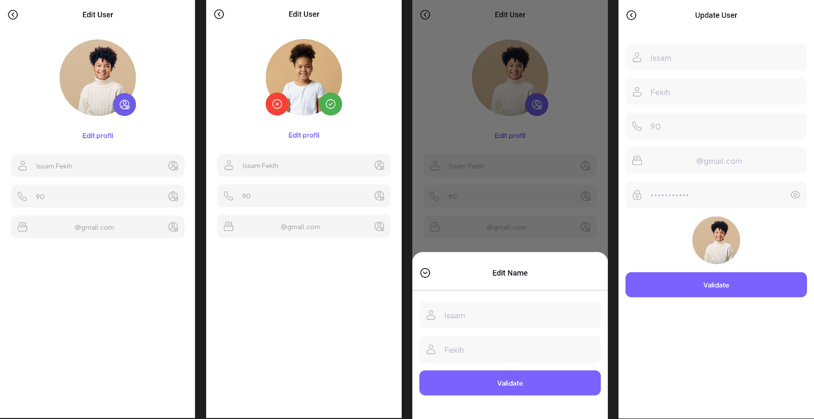
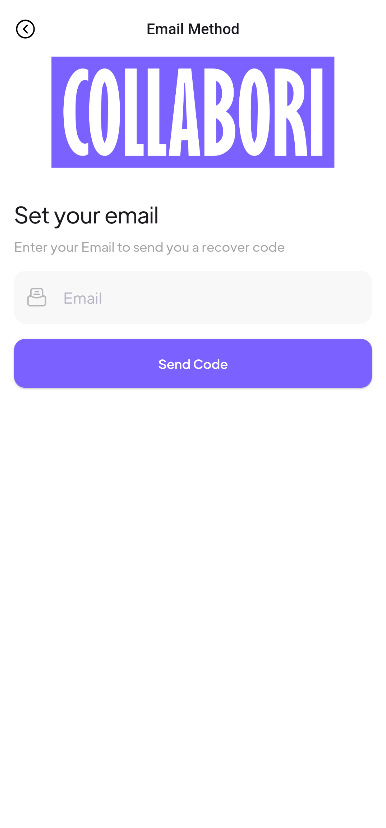
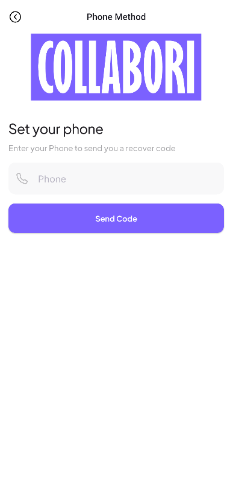

# COLLABORI
 <br>

- Description <br>
> Collaborative Outing Budget. <br><br>
An app that help users to organize 
group outings for hikes, parties,
trips and events. <br><br>
Each participant can contribute to the 
budget, suggest locations or vote 
for activities. <br><br>
The app consolidates all practical information 
like budget, location, transport and activities
in a collaborative space with notifications and reminders 
to simplify coordination.

### User Module
1. Onboarding, SignUp and SignIn : <br>



2. Change password with email or phone method : <br>



3. Sending a verification code by email or whatsapp message : <br>



4. Change password after verification code : <br>



5. User Login sessions : <br>



6. User can easily update their information : <br>



7. Verification before deletion : <br>



8. User can follow their events or the ones they want to participate : <br>




- IDE <br>
 <br>

- FRAMEWORK <br>
 <br>

- LANGUAGE <br>
 <br>

- TOOLS <br>
 <br>
 <br>


- DATABASE <br>
User Module <br>
 <br>
Event Module <br>
 <br>


```
GITHUB
```